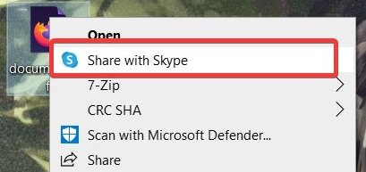
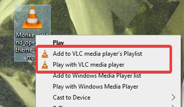

# contextual_menu_cleaner
Collection of scripts to help cleaning windows contextual menu, usually these 
scripts have to be run in a powershell console with Administrator rights.  
`Tested on Windows 10 Pro 21H1 (Version 10.0.19043 Build 19043)`

* **share_with_skype.ps1**: remove "share with skype" contextual entry.
    Skype entry is dependant on the skype version and each new update
    re-enable the entry. This script detect skype related registry key
    and delete the relevant value.  
    

* **vlc_addto_play.ps1**: remove "Add to playlist"  and "Play with VLC" 
    contextual entries.  
    
